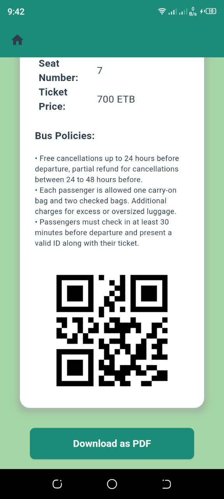

# Finote - Revolutionizing Bus Travel in Ethiopia

 <!-- Add the logo image link here -->

## Overview

**Finote** is a mobile application designed to transform bus travel in Ethiopia by providing travelers with the convenience of purchasing tickets online and enabling bus operators to simplify their operations and boost ticket sales. The app offers user-friendly interfaces, secure payment options, and real-time schedule management, making bus travel more efficient and accessible for everyone.

## Features

- **Easy Ticket Purchase**: Buy bus tickets anytime, anywhere, with just a few taps.
- **Secure Payments**: Integrated with secure payment methods to ensure safe transactions.
- **Real-time Schedule Management**: Stay updated with bus schedules and availability in real-time.
- **User-friendly Interface**: Simple and intuitive design for a seamless user experience.
- **Bus Operator Tools**: Tools for operators to manage schedules, track sales, and validate tickets.

## Getting Started

### Prerequisites

Before you begin, ensure you have met the following requirements:

- A computer with [Flutter](https://flutter.dev/docs/get-started/install) installed.
- Access to an Android or iOS device for testing, or an emulator.

### Installation

1. **Clone the repository**:
    ```bash
    git clone https://github.com/your-username/finote.git
    cd finote
    ```

2. **Install dependencies**:
    ```bash
    flutter pub get
    ```

3. **Run the app**:
    ```bash
    flutter run
    ```

### Directory Structure

```plaintext
├── lib
│   ├── models           # Data models
│   ├── screens          # UI screens
│   ├── services         # Business logic and API interactions
│   ├── widgets          # Reusable widgets
│   ├── main.dart        # Entry point of the application
├── assets               # Images, fonts, etc.
├── test                 # Unit and widget tests
└── README.md            # Project documentation
```
<table>
  <tr>
  </tr>
  <tr>
    <td></td>
    <td></td>
  </tr>

  <tr>
    <td></td>
    <td></td>
  </tr>
  

  <tr>
    <td></td>
    <td></td>
    <td></td>
  </tr>
  
  <tr>
    <td></td>
    <td></td>
  </tr>
        
 </table>
 
